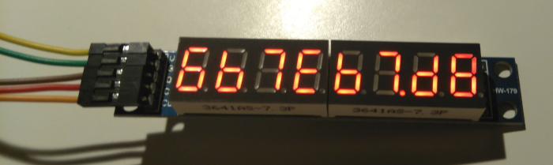
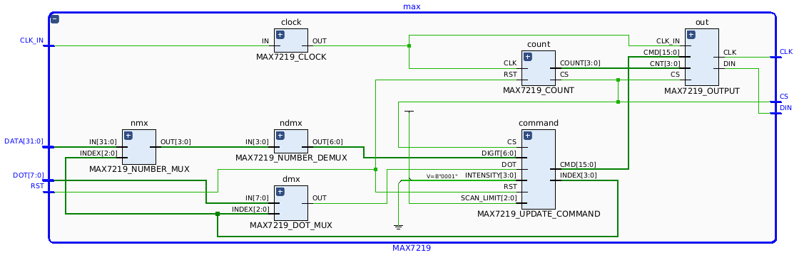

# MAX7219-LEDS
A 8-Digit LED Display driver for FPGA using MAX7219.

Developing for FPGA is great, but the debug process can be very hard! There is no console for output messages and to create simulations consume a lot of time. A way to make our lives easier could be using display modules based on MAX7219. It works with a SPI interface (only three wires) and it is able to control up to 8 digits. Those digits are updated in real time and extremely fast (the speed can be controlled via internal clock divider).

Every digit will be displayed in hexadecimal format:

There are 32bits input (4bits for each digit) and more 8bits for dots LEDs (one bit for each digit).

